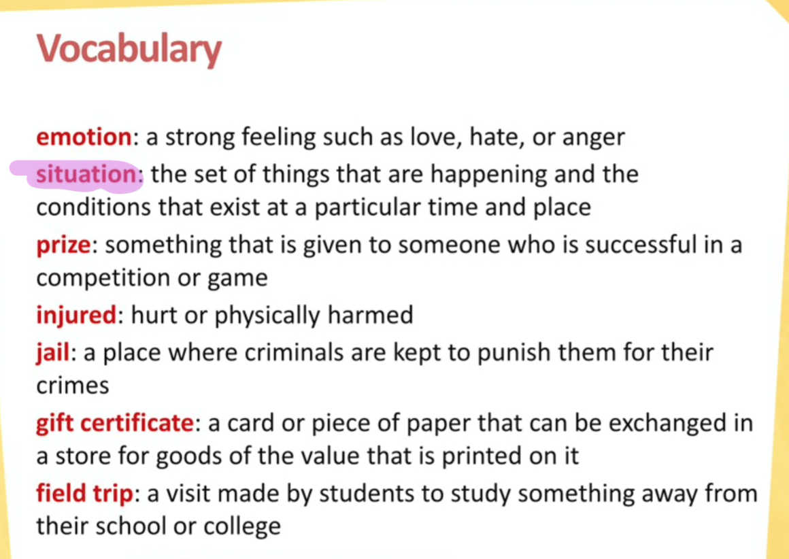

# Basic Feelings
> 2020-08-06

What did you do today?
And how did the interview go?

How do you feel today?
Do you know any other feelings?

Yes, got it!
Let's carry on the next page.

> Vocabulary
> 
>  

What emotions do you see in each picture?

How did she feel?

What is the men feel?

---

My favourite shoes are lost.

I won first prize.

Is there anything that I can do to comfort her?

I lost my mother's earrings. **What should I do**?

What have you done? You broke it.

What? I cannot believe it.

---

The boy's arm is injured, he feels hurt and sad.
The woman looks very hot.
The woman was feeling hungry and now **that she** got a cake.

---
Are you not excited?  

